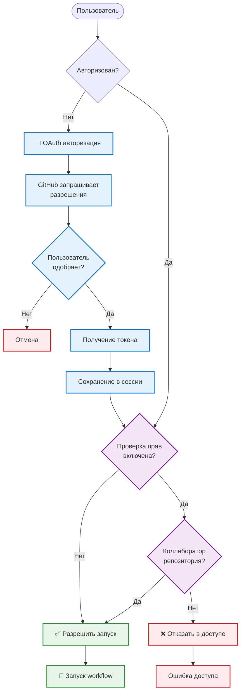
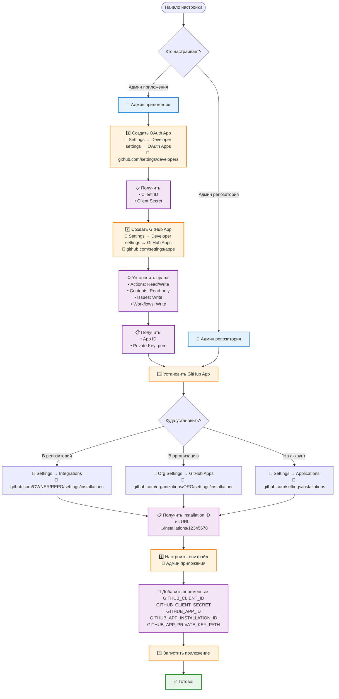

# GitHub Action Executor

Веб-интерфейс для удобного запуска GitHub Actions workflows с проверкой прав доступа.

## Зачем это нужно?

**Проблема:** Запуск GitHub Actions workflows обычно требует:
- Перехода в GitHub UI
- Навигации по репозиторию
- Ручного заполнения всех параметров
- Повторения этих действий для каждого запуска

**Решение:** GitHub Action Executor предоставляет:
- 🚀 **Быстрый запуск** через веб-интерфейс или прямые ссылки
- 🔐 **Безопасность** - проверка прав коллаборатора перед запуском
- 🎯 **Удобство** - автоматическое определение параметров workflow
- 🔗 **Интеграция** - REST API для автоматизации
- 📱 **Badges** - создание кнопок для быстрого запуска в документации

## Как это работает?


### 1. Запуск через веб-интерфейс

Самый простой способ для ручного запуска:

1. Откройте веб-интерфейс
2. Авторизуйтесь через GitHub (один раз)
3. Выберите репозиторий, workflow и ветку
4. Форма автоматически подгрузит все доступные параметры
5. Заполните параметры и нажмите "Запустить"
6. Получите ссылку на запуск в GitHub Actions

**Преимущества:**
- Автоматическое определение всех параметров workflow из YAML
- Динамические поля (текст, выбор, чекбоксы) в зависимости от типа параметра
- Фильтрация веток по настраиваемым паттернам
- Проверка прав доступа перед запуском

### 2. Запуск по прямой ссылке

Идеально для создания закладок или badges в документации:

```
http://your-server/workflow/trigger?owner=owner&repo=my-repo&workflow_id=ci.yml&ref=main&test_type=pytest
```

**Как это работает:**
- Пользователь переходит по ссылке
- Если не авторизован → автоматическая авторизация с возвратом
- Workflow запускается автоматически с параметрами из ссылки
- Показывается результат запуска

**Пример использования:**
- Создайте badge в README для быстрого запуска тестов
- Добавьте ссылку в PR для запуска проверок
- Используйте в документации для демонстрации workflows

### 3. Автоматизация через REST API

Для интеграции в CI/CD пайплайны и скрипты:

```bash
curl -X POST http://your-server/api/trigger \
  -H "Content-Type: application/json" \
  -H "Cookie: session=<your-session>" \
  -d '{
    "owner": "username",
    "repo": "repo-name",
    "workflow_id": "ci.yml",
    "ref": "main",
    "inputs": {
      "test_targets": "tests/",
      "test_type": "pytest"
    }
  }'
```

**Применение:**
- Интеграция в CI/CD пайплайны
- Автоматизация тестирования
- Создание скриптов для массового запуска
- Интеграция с другими системами

## Авторизация и проверка прав

Система обеспечивает безопасный доступ к запуску workflows через двухэтапную проверку:



**Как это работает:**

1. **OAuth авторизация:**
   - Пользователь перенаправляется на GitHub
   - Запрашиваются разрешения (read:user, repo)
   - GitHub возвращает токен доступа
   - Токен сохраняется в сессии сервера (безопасно)

2. **Проверка прав:**
   - Система проверяет, является ли пользователь коллаборатором репозитория
   - Проверка выполняется через GitHub API
   - Только коллабораторы могут запускать workflows
   - Можно отключить через `CHECK_PERMISSIONS=false` (не рекомендуется)

**Безопасность:**
- ✅ CSRF защита через state токен в OAuth
- ✅ Токены хранятся только на сервере
- ✅ Проверка прав перед каждым запуском
- ✅ Использование GitHub App вместо личных токенов

## Подключение к приложению

Для начала работы необходимо настроить OAuth App и GitHub App в GitHub:



**Кто что делает:**

- **Админ приложения:**
  - Создает OAuth App и GitHub App
  - Настраивает переменные окружения
  - Запускает приложение

- **Админ репозитория/организации:**
  - Устанавливает GitHub App в репозиторий или организацию
  - Предоставляет Installation ID

**Что нужно получить:**
- OAuth App: Client ID, Client Secret
- GitHub App: App ID, Installation ID, Private Key (.pem файл)

**Важно: Работа с организациями**

Если вы уже настроили приложение для личного аккаунта и хотите использовать его с организацией:

✅ **Можно использовать те же:**
- OAuth App (Client ID, Client Secret) - один OAuth App работает для всех
- GitHub App (App ID, Private Key) - один GitHub App можно установить в несколько мест

⚠️ **Нужно обновить:**
- **Installation ID** - если GitHub App установлен в организации, используйте Installation ID этой установки
- Если организация требует одобрения OAuth Apps, админ должен одобрить ваше OAuth App в настройках организации

**Как получить Installation ID для организации:**
1. Установите GitHub App в организацию (если еще не установлен)
2. Перейдите в настройки организации → GitHub Apps
3. Найдите ваше приложение и откройте его
4. Installation ID будет в URL: `.../installations/12345678`

## Быстрый старт

### 1. Установка

```bash
git clone <repository-url>
cd github_action_executor
pip install -r requirements.txt
```

### 2. Настройка GitHub

#### 👤 Администратор приложения

**Создание OAuth App:**

1. **Перейдите в настройки:**
   - GitHub → Ваш профиль (правый верхний угол) → **Settings**
   - Или напрямую: https://github.com/settings/profile

2. **Откройте Developer settings:**
   - В левом меню: **Developer settings**
   - Или напрямую: https://github.com/settings/apps

3. **Создайте OAuth App:**
   - Вкладка **OAuth Apps** → кнопка **New OAuth App**
   - Или напрямую: https://github.com/settings/developers/new

4. **Заполните форму:**
   - **Application name**: GitHub Action Executor (или любое имя)
   - **Homepage URL**: `http://localhost:8000` (для локальной разработки)
   - **Authorization callback URL**: `http://localhost:8000/auth/github/callback`

5. **Получите credentials:**
   - После создания откроется страница приложения
   - **Client ID** — виден сразу на странице
   - **Client Secret** — нажмите **Generate a new client secret**, скопируйте секрет (показывается только один раз!)

**Создание GitHub App:**

1. **Перейдите в Developer settings:**
   - GitHub → Settings → **Developer settings**
   - Или напрямую: https://github.com/settings/apps

2. **Создайте GitHub App:**
   - Вкладка **GitHub Apps** → кнопка **New GitHub App**
   - Или напрямую: https://github.com/settings/apps/new

3. **Заполните основную информацию:**
   - **GitHub App name**: GitHub Action Executor (или любое имя)
   - **Homepage URL**: `http://localhost:8000`
   - **User authorization callback URL**: `http://localhost:8000/auth/github/callback`

4. **Настройте права (Permissions):**
   - **Actions**: Read and write
   - **Contents**: Read-only (или Read and write, если нужен backport с изменениями файлов)
   - **Issues**: Write (требуется для создания комментариев в issues и PR)
   - **Workflows**: Write (требуется для изменения workflow файлов при backport)
   - **Metadata**: Read-only (включено по умолчанию)

5. **Получите App ID и Private Key:**
   - После создания откроется страница приложения
   - **App ID** — виден сразу на странице (например: `123456`)
   - **Private keys** — нажмите **Generate a private key**, скачайте `.pem` файл (сохраните его, он больше не будет показан!)

#### 👤 Администратор организации/репозитория

**Установка GitHub App:**

1. **Перейдите на страницу GitHub App:**
   - Попросите администратора приложения предоставить ссылку на созданный GitHub App
   - Или найдите приложение в списке: Settings → Developer settings → GitHub Apps

2. **Установите приложение:**
   - На странице GitHub App нажмите **Install App**
   - Или перейдите в настройки организации/репозитория:
     - **Для репозитория**: Settings → Integrations → GitHub Apps → Configure
     - **Для организации**: Organization Settings → GitHub Apps → Configure
     - **Для аккаунта**: Settings → Applications → Installed GitHub Apps → Configure

3. **Выберите где установить:**
   - Выберите репозиторий, организацию или аккаунт
   - Нажмите **Install**

4. **Получите Installation ID:**
   - После установки откроется страница установки
   - **Installation ID** находится в URL: `https://github.com/settings/installations/12345678`
   - Скопируйте число после `/installations/` (например: `12345678`)
   - **Передайте Installation ID администратору приложения** для настройки переменных окружения

### 3. Настройка переменных окружения

Создайте файл `.env`:

```bash
SECRET_KEY=<сгенерируйте: openssl rand -hex 32>
GITHUB_CLIENT_ID=<из OAuth App>
GITHUB_CLIENT_SECRET=<из OAuth App>
GITHUB_APP_ID=<из GitHub App>
GITHUB_APP_INSTALLATION_ID=<из URL установки>
GITHUB_APP_PRIVATE_KEY_PATH=github-app-private-key.pem
```

### 4. Запуск

```bash
python app.py
```

Приложение будет доступно по адресу: http://localhost:8000

## Возможности

- ✅ Авторизация через GitHub OAuth
- ✅ Проверка прав коллаборатора перед запуском
- ✅ Динамическая загрузка workflows и веток
- ✅ Автоматическое определение workflow inputs из YAML
- ✅ Фильтрация веток по regex-паттернам
- ✅ Веб-форма с динамическими полями
- ✅ REST API для программного доступа
- ✅ Кэширование для улучшения производительности
- ✅ Готово для развертывания в Yandex Cloud

## Документация

📖 **Подробная документация:** [README-EXTENDED.md](README-EXTENDED.md)

Расширенная документация включает:
- Детальные диаграммы пользовательских потоков
- Полное описание API endpoints
- Настройка конфигурации
- Инструкции по развертыванию
- Решение проблем

## Примеры использования

### Badge в README

```markdown
[](http://your-server/?owner=owner&repo=repo&workflow_id=run_tests.yml&test_type=pytest)
```

### Прямая ссылка для запуска

```
http://your-server/workflow/trigger?owner=owner&repo=my-repo&workflow_id=ci.yml&ref=main&tests=unit,integration
```

### Примеры workflow

В репозитории есть два готовых примера workflow, которые можно использовать как шаблоны:

#### 1. Тестовый workflow (`.github/workflows/test.yml`)

Запускает тесты с возможностью комментирования в PR:

```yaml
name: Run Tests

on:
  workflow_dispatch:
    inputs:
      test_type:
        description: 'Type of tests to run'
        required: false
        type: choice
        options:
          - all
          - unit
          - integration
        default: 'all'
      from_pr:
        description: 'PR number to comment on (optional)'
        required: false
        type: string
```

**Использование:**
- Запуск всех тестов: `test_type=all`
- Запуск только unit тестов: `test_type=unit`
- С комментарием в PR: `from_pr=123` (номер PR)

**Пример запуска через веб-интерфейс:**
- Выберите workflow: `test.yml`
- `test_type`: `all` (или `unit`, `integration`)
- `from_pr`: `123` (если хотите оставить комментарий в PR #123)

#### 2. Backport workflow (`.github/workflows/backport.yml`)

Переносит коммиты из одной ветки в другую:

```yaml
name: Backport

on:
  workflow_dispatch:
    inputs:
      source_branch:
        description: 'Source branch to backport from'
        required: true
        type: string
        default: 'main'
      target_branch:
        description: 'Target branch to backport to'
        required: true
        type: string
      commit_sha:
        description: 'Specific commit SHA to backport (optional)'
        required: false
        type: string
      from_pr:
        description: 'PR number to comment on (optional)'
        required: false
        type: string
```

**Использование:**
- Backport всех коммитов: укажите `source_branch` и `target_branch`
- Backport конкретного коммита: добавьте `commit_sha`
- С комментарием в PR: укажите `from_pr=123`

**Пример запуска:**
- `source_branch`: `main`
- `target_branch`: `release/v1.0`
- `commit_sha`: `abc1234` (опционально, для конкретного коммита)
- `from_pr`: `123` (опционально, для комментария в PR)

**Особенности:**
- Автоматически создает целевую ветку, если её нет
- Оставляет комментарии в PR при запуске, успехе и ошибке
- Обрабатывает конфликты при cherry-pick

#### 3. Автоматическое добавление badge в PR (`.github/workflows/pr-badges.yml`)

Автоматически добавляет badge и ссылки для запуска workflow в каждый новый PR:

```yaml
name: Add PR Badges

on:
  pull_request:
    types: [opened, synchronize]
```

**Как это работает:**
1. При открытии или обновлении PR автоматически добавляется комментарий
2. В комментарии есть badge и прямые ссылки для запуска тестов и backport
3. Ссылки уже содержат параметр `from_pr`, поэтому результаты автоматически появятся в PR

**Настройка домена приложения:**

1. **Через переменную репозитория (рекомендуется):**
   - Перейдите в Settings → Secrets and variables → Actions
   - Вкладка **Variables** → **New repository variable**
   - Name: `APP_DOMAIN`
   - Value: `https://your-app-domain.com` (ваш домен приложения)
   - Нажмите **Add variable**

2. **Или отредактируйте workflow напрямую:**
   - Откройте `.github/workflows/pr-badges.yml`
   - Найдите строку: `const appDomain = '${{ vars.APP_DOMAIN }}' || 'http://localhost:8000';`
   - Замените на: `const appDomain = 'https://your-app-domain.com';`

**Пример комментария в PR:**
```markdown
## 🚀 Quick Actions

Use these badges to quickly run workflows for this PR:

[](link)
[](link)
```

### Создание своего workflow

Ваш workflow должен поддерживать `workflow_dispatch`:

```yaml
name: My Workflow

on:
  workflow_dispatch:
    inputs:
      my_param:
        description: 'My parameter'
        required: false
        type: string
        default: 'default_value'

jobs:
  my_job:
    runs-on: ubuntu-latest
    steps:
      - uses: actions/checkout@v4
      - name: Do something
        run: echo "Parameter: ${{ inputs.my_param }}"
```

## Лицензия

MIT

## Поддержка

Если у вас возникли вопросы или проблемы, создайте issue в репозитории.

