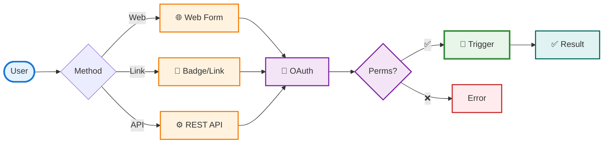
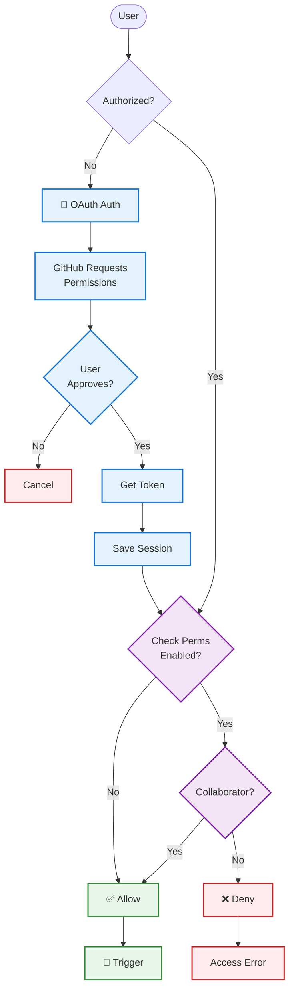
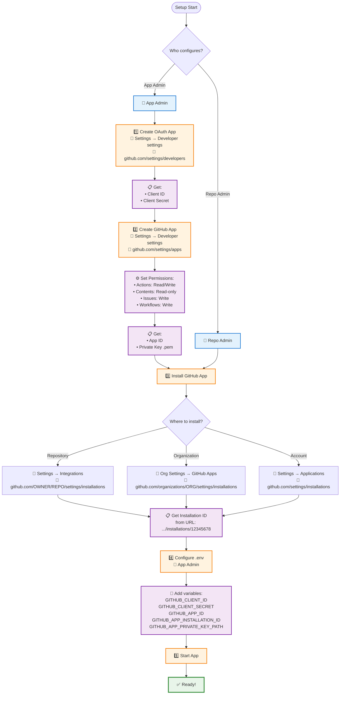

# GitHub Action Executor

Web interface for convenient GitHub Actions workflow execution with access control verification.

## Why is this needed?

**Problem:** Running GitHub Actions workflows typically requires:
- Navigating to GitHub UI
- Browsing through the repository
- Manually filling in all parameters
- Repeating these actions for each run

**Solution:** GitHub Action Executor provides:
- 🚀 **Quick launch** via web interface or direct links
- 🔐 **Security** - collaborator permission check before execution
- 🎯 **Convenience** - automatic workflow parameter detection
- 🔗 **Integration** - REST API for automation
- 📱 **Badges** - create buttons for quick launch in documentation

## How does it work?



### 1. Launch via web interface

The simplest way for manual execution:

1. Open the web interface
2. Authorize via GitHub (once)
3. Select repository, workflow, and branch
4. The form will automatically load all available parameters
5. Fill in parameters and click "Run"
6. Get a link to the run in GitHub Actions

**Advantages:**
- Automatic detection of all workflow parameters from YAML
- Dynamic fields (text, choice, checkboxes) based on parameter type
- Branch filtering by configurable patterns
- Access permission check before execution

### 2. Launch via direct link

Perfect for creating bookmarks or badges in documentation:

```
http://your-server/workflow/trigger?owner=owner&repo=my-repo&workflow_id=ci.yml&ref=main&test_type=pytest
```

**How it works:**
- User clicks the link
- If not authorized → automatic authorization with return
- Workflow launches automatically with parameters from the link
- Run result is displayed

**Usage examples:**
- Create a badge in README for quick test runs
- Add a link in PR for running checks
- Use in documentation to demonstrate workflows

**Applications:**
- CI/CD pipeline integration
- Test automation
- Scripts for bulk execution
- Integration with other systems

## Authorization and permission check

The system provides secure access to workflow execution through two-step verification:



**How it works:**

1. **OAuth authorization:**
   - User is redirected to GitHub
   - Permissions are requested (read:user, repo)
   - GitHub returns access token
   - Token is stored in server session (secure)

2. **Permission check:**
   - System checks if user is a repository collaborator
   - Check is performed via GitHub API
   - Only collaborators can trigger workflows
   - Can be disabled via `CHECK_PERMISSIONS=false` (not recommended)

**Security:**
- ✅ CSRF protection via state token in OAuth
- ✅ Tokens stored only on server
- ✅ Permission check before each execution
- ✅ Using GitHub App instead of personal tokens

## Application setup

To get started, you need to configure OAuth App and GitHub App in GitHub:



**Who does what:**

- **App administrator:**
  - Creates OAuth App and GitHub App
  - Configures environment variables
  - Starts the application

- **Repository/organization administrator:**
  - Installs GitHub App in repository or organization
  - Provides Installation ID

**What you need to get:**
- OAuth App: Client ID, Client Secret
- GitHub App: App ID, Installation ID, Private Key (.pem file)

**Important: Working with organizations**

If you've already configured the app for a personal account and want to use it with an organization:

✅ **You can reuse:**
- OAuth App (Client ID, Client Secret) - one OAuth App works for all
- GitHub App (App ID, Private Key) - one GitHub App can be installed in multiple places

⚠️ **You need to update:**
- **Installation ID** - if GitHub App is installed in an organization, use that installation's Installation ID
- If the organization requires OAuth App approval, the admin must approve your OAuth App in organization settings

**How to get Installation ID for organization:**
1. Install GitHub App in the organization (if not already installed)
2. Go to organization settings → GitHub Apps
3. Find your app and open it
4. Installation ID will be in the URL: `.../installations/12345678`

## Быстрый старт

### 1. Установка

```bash
git clone <repository-url>
cd github_action_executor
pip install -r requirements.txt
```

### 2. Настройка GitHub

#### 👤 Администратор приложения

**Создание OAuth App:**

1. **Перейдите в настройки:**
   - GitHub → Ваш профиль (правый верхний угол) → **Settings**
   - Или напрямую: https://github.com/settings/profile

2. **Откройте Developer settings:**
   - В левом меню: **Developer settings**
   - Или напрямую: https://github.com/settings/apps

3. **Создайте OAuth App:**
   - Вкладка **OAuth Apps** → кнопка **New OAuth App**
   - Или напрямую: https://github.com/settings/developers/new

4. **Заполните форму:**
   - **Application name**: GitHub Action Executor (или любое имя)
   - **Homepage URL**: `http://localhost:8000` (для локальной разработки)
   - **Authorization callback URL**: `http://localhost:8000/auth/github/callback`

5. **Получите credentials:**
   - После создания откроется страница приложения
   - **Client ID** — виден сразу на странице
   - **Client Secret** — нажмите **Generate a new client secret**, скопируйте секрет (показывается только один раз!)

**Создание GitHub App:**

1. **Перейдите в Developer settings:**
   - GitHub → Settings → **Developer settings**
   - Или напрямую: https://github.com/settings/apps

2. **Создайте GitHub App:**
   - Вкладка **GitHub Apps** → кнопка **New GitHub App**
   - Или напрямую: https://github.com/settings/apps/new

3. **Заполните основную информацию:**
   - **GitHub App name**: GitHub Action Executor (или любое имя)
   - **Homepage URL**: `http://localhost:8000`
   - **User authorization callback URL**: `http://localhost:8000/auth/github/callback`

4. **Настройте права (Permissions):**
   - **Actions**: Read and write
   - **Contents**: Read-only (или Read and write, если нужен backport с изменениями файлов)
   - **Issues**: Write (требуется для создания комментариев в issues и PR)
   - **Workflows**: Write (требуется для изменения workflow файлов при backport)
   - **Metadata**: Read-only (включено по умолчанию)

5. **Получите App ID и Private Key:**
   - После создания откроется страница приложения
   - **App ID** — виден сразу на странице (например: `123456`)
   - **Private keys** — нажмите **Generate a private key**, скачайте `.pem` файл (сохраните его, он больше не будет показан!)

#### 👤 Администратор организации/репозитория

**Установка GitHub App:**

1. **Перейдите на страницу GitHub App:**
   - Попросите администратора приложения предоставить ссылку на созданный GitHub App
   - Или найдите приложение в списке: Settings → Developer settings → GitHub Apps

2. **Установите приложение:**
   - На странице GitHub App нажмите **Install App**
   - Или перейдите в настройки организации/репозитория:
     - **Для репозитория**: Settings → Integrations → GitHub Apps → Configure
     - **Для организации**: Organization Settings → GitHub Apps → Configure
     - **Для аккаунта**: Settings → Applications → Installed GitHub Apps → Configure

3. **Выберите где установить:**
   - Выберите репозиторий, организацию или аккаунт
   - Нажмите **Install**

4. **Получите Installation ID:**
   - После установки откроется страница установки
   - **Installation ID** находится в URL: `https://github.com/settings/installations/12345678`
   - Скопируйте число после `/installations/` (например: `12345678`)
   - **Передайте Installation ID администратору приложения** для настройки переменных окружения

### 3. Настройка переменных окружения

Создайте файл `.env`:

```bash
SECRET_KEY=<сгенерируйте: openssl rand -hex 32>
GITHUB_CLIENT_ID=<из OAuth App>
GITHUB_CLIENT_SECRET=<из OAuth App>
GITHUB_APP_ID=<из GitHub App>
GITHUB_APP_INSTALLATION_ID=<из URL установки>
GITHUB_APP_PRIVATE_KEY_PATH=github-app-private-key.pem
```

### 4. Запуск

```bash
python app.py
```

Приложение будет доступно по адресу: http://localhost:8000

## Возможности

- ✅ Авторизация через GitHub OAuth
- ✅ Проверка прав коллаборатора перед запуском
- ✅ Динамическая загрузка workflows и веток
- ✅ Автоматическое определение workflow inputs из YAML
- ✅ Фильтрация веток по regex-паттернам
- ✅ Веб-форма с динамическими полями
- ✅ REST API для программного доступа
- ✅ Кэширование для улучшения производительности
- ✅ Готово для развертывания в Yandex Cloud

## Документация

📖 **Подробная документация:** [README-EXTENDED.md](README-EXTENDED.md)

Расширенная документация включает:
- Детальные диаграммы пользовательских потоков
- Полное описание API endpoints
- Настройка конфигурации
- Инструкции по развертыванию
- Решение проблем

## Примеры использования

### Badge в README

```markdown
[](http://your-server/?owner=owner&repo=repo&workflow_id=run_tests.yml&test_type=pytest)
```

### Прямая ссылка для запуска

```
http://your-server/workflow/trigger?owner=owner&repo=my-repo&workflow_id=ci.yml&ref=main&tests=unit,integration
```

### Примеры workflow

В репозитории есть два готовых примера workflow, которые можно использовать как шаблоны:

#### 1. Тестовый workflow (`.github/workflows/test.yml`)

Запускает тесты с возможностью комментирования в PR:

```yaml
name: Run Tests

on:
  workflow_dispatch:
    inputs:
      test_type:
        description: 'Type of tests to run'
        required: false
        type: choice
        options:
          - all
          - unit
          - integration
        default: 'all'
      from_pr:
        description: 'PR number to comment on (optional)'
        required: false
        type: string
```

**Использование:**
- Запуск всех тестов: `test_type=all`
- Запуск только unit тестов: `test_type=unit`
- С комментарием в PR: `from_pr=123` (номер PR)

**Пример запуска через веб-интерфейс:**
- Выберите workflow: `test.yml`
- `test_type`: `all` (или `unit`, `integration`)
- `from_pr`: `123` (если хотите оставить комментарий в PR #123)

#### 2. Backport workflow (`.github/workflows/backport.yml`)

Переносит коммиты из одной ветки в другую:

```yaml
name: Backport

on:
  workflow_dispatch:
    inputs:
      source_branch:
        description: 'Source branch to backport from'
        required: true
        type: string
        default: 'main'
      target_branch:
        description: 'Target branch to backport to'
        required: true
        type: string
      commit_sha:
        description: 'Specific commit SHA to backport (optional)'
        required: false
        type: string
      from_pr:
        description: 'PR number to comment on (optional)'
        required: false
        type: string
```

**Использование:**
- Backport всех коммитов: укажите `source_branch` и `target_branch`
- Backport конкретного коммита: добавьте `commit_sha`
- С комментарием в PR: укажите `from_pr=123`

**Пример запуска:**
- `source_branch`: `main`
- `target_branch`: `release/v1.0`
- `commit_sha`: `abc1234` (опционально, для конкретного коммита)
- `from_pr`: `123` (опционально, для комментария в PR)

**Особенности:**
- Автоматически создает целевую ветку, если её нет
- Оставляет комментарии в PR при запуске, успехе и ошибке
- Обрабатывает конфликты при cherry-pick

#### 3. Автоматическое добавление badge в PR (`.github/workflows/pr-badges.yml`)

Автоматически добавляет badge и ссылки для запуска workflow в каждый новый PR:

```yaml
name: Add PR Badges

on:
  pull_request:
    types: [opened, synchronize]
```

**Как это работает:**
1. При открытии или обновлении PR автоматически добавляется комментарий
2. В комментарии есть badge и прямые ссылки для запуска тестов и backport
3. Ссылки уже содержат параметр `from_pr`, поэтому результаты автоматически появятся в PR

**Настройка домена приложения:**

1. **Через переменную репозитория (рекомендуется):**
   - Перейдите в Settings → Secrets and variables → Actions
   - Вкладка **Variables** → **New repository variable**
   - Name: `APP_DOMAIN`
   - Value: `https://your-app-domain.com` (ваш домен приложения)
   - Нажмите **Add variable**

2. **Или отредактируйте workflow напрямую:**
   - Откройте `.github/workflows/pr-badges.yml`
   - Найдите строку: `const appDomain = '${{ vars.APP_DOMAIN }}' || 'http://localhost:8000';`
   - Замените на: `const appDomain = 'https://your-app-domain.com';`

**Пример комментария в PR:**
```markdown
## 🚀 Quick Actions

Use these badges to quickly run workflows for this PR:

[](link)
[](link)
```

### Создание своего workflow

Ваш workflow должен поддерживать `workflow_dispatch`:

```yaml
name: My Workflow

on:
  workflow_dispatch:
    inputs:
      my_param:
        description: 'My parameter'
        required: false
        type: string
        default: 'default_value'

jobs:
  my_job:
    runs-on: ubuntu-latest
    steps:
      - uses: actions/checkout@v4
      - name: Do something
        run: echo "Parameter: ${{ inputs.my_param }}"
```

## Решение проблем

### Ошибка "Must have admin rights to Repository"

Если вы получаете ошибку **"Failed to trigger workflow: Must have admin rights to Repository"**, это сообщение от GitHub API может быть вводящим в заблуждение. На самом деле для запуска workflow требуется разрешение на **Write** (или выше), а не обязательно Admin.

**Решение:**

1. **Разрешить Actions в организации** (если репозиторий в организации):
   - Organization Settings → Policies → Actions
   - Включите "Allow all actions and reusable workflows"
   - В разделе "Workflow permissions" установите "Read and write permissions"
   - Отметьте "Allow GitHub Actions to create and approve pull requests"

2. **Дать пользователю права на репозиторий:**
   - Repo → Settings → Collaborators & teams
   - Добавьте пользователя с правами **Write** (достаточно, Admin не обязательно)
   - Пользователь должен быть членом организации (если репозиторий в организации)

3. **Альтернатива:**
   - Установите `USE_USER_TOKEN_FOR_WORKFLOWS=false` в конфигурации
   - Тогда workflow будут запускаться от имени GitHub App, и права администратора или write не потребуются

📖 **Подробная инструкция:** см. раздел "Решение проблем" в [README-EXTENDED.md](README-EXTENDED.md)

## Лицензия

MIT

## Поддержка

Если у вас возникли вопросы или проблемы, создайте issue в репозитории.

