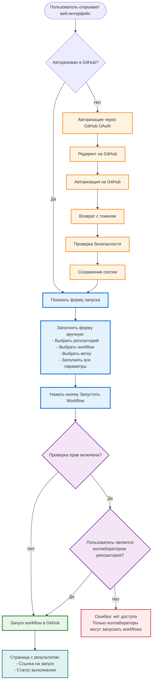
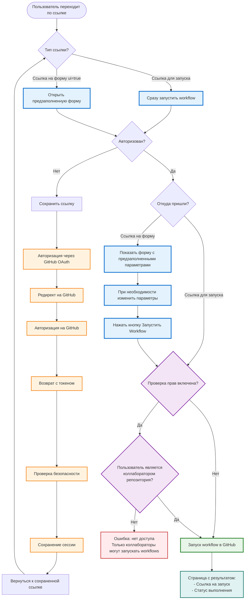
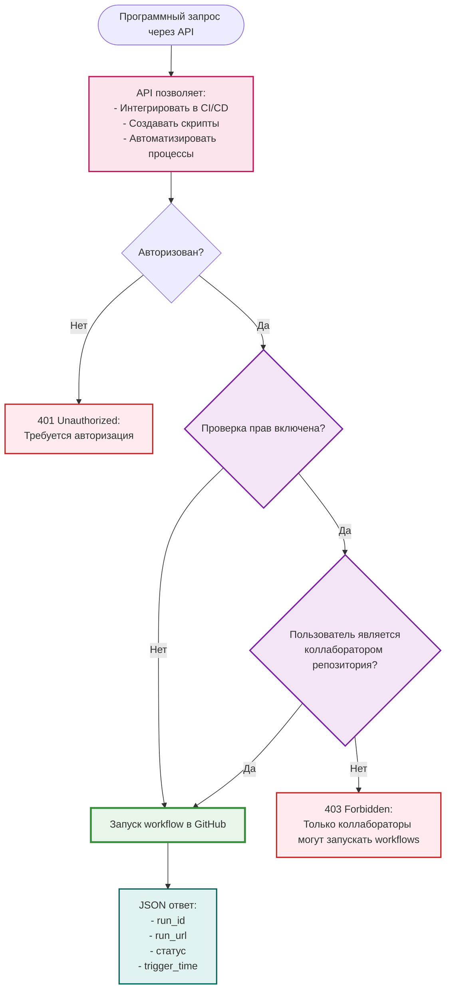
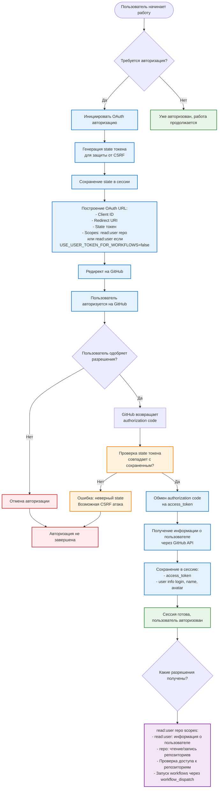
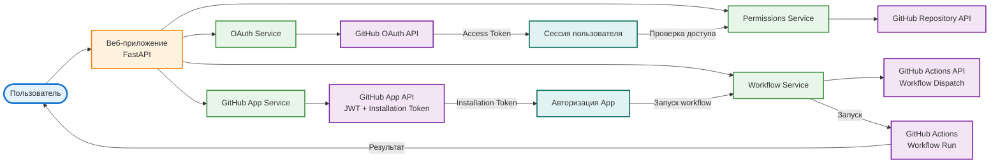

# GitHub Action Executor

Веб-интерфейс для запуска GitHub Actions workflows с проверкой прав коллаборатора и возможностью выбора тестов.

## Возможности

- ✅ Авторизация через GitHub OAuth
- ✅ Проверка прав коллаборатора перед запуском workflow (настраивается)
- ✅ Динамическая загрузка workflows и веток из репозитория
- ✅ Автоматическое определение workflow inputs из YAML
- ✅ Фильтрация веток по regex-паттернам
- ✅ Запуск workflow от имени пользователя или GitHub App (настраивается)
- ✅ Веб-форма с динамическими полями для всех workflow inputs
- ✅ REST API для программного доступа
- ✅ Кэширование веток и workflows для улучшения производительности
- ✅ Готово для развертывания в Yandex Cloud

## Быстрый старт

### 1. Установка

```bash
# Клонируйте репозиторий
git clone <repository-url>
cd github_action_executor

# Установите зависимости
pip install -r requirements.txt
```

### 2. Настройка GitHub

**Создайте OAuth App:**
1. Перейдите в [GitHub Settings > Developer settings > OAuth Apps](https://github.com/settings/developers)
2. Нажмите "New OAuth App"
3. Заполните:
   - **Application name**: GitHub Action Executor
   - **Homepage URL**: `http://localhost:8000`
   - **Authorization callback URL**: `http://localhost:8000/auth/github/callback`
4. Сохраните **Client ID** и **Client Secret**

**Создайте GitHub App:**
1. Перейдите в [GitHub Settings > Developer settings > GitHub Apps](https://github.com/settings/apps)
2. Нажмите "New GitHub App"
3. Заполните:
   - **GitHub App name**: GitHub Action Executor
   - **Homepage URL**: `http://localhost:8000`
   - **Permissions**:
     - **Actions**: Read and write
     - **Contents**: Read-only
     - **Metadata**: Read-only
4. Сохраните **App ID**
5. Сгенерируйте **Private key** и скачайте файл `.pem`
6. Установите приложение в репозиторий или организацию
7. Найдите **Installation ID** в URL установки

### 3. Настройка переменных окружения

Создайте файл `.env`:

```bash
# Обязательные
SECRET_KEY=<сгенерируйте через: openssl rand -hex 32>
GITHUB_CLIENT_ID=<из OAuth App>
GITHUB_CLIENT_SECRET=<из OAuth App>
GITHUB_APP_ID=<из GitHub App>
GITHUB_APP_INSTALLATION_ID=<из URL установки>
GITHUB_APP_PRIVATE_KEY_PATH=github-app-private-key.pem
```

### 4. Запуск

```bash
python app.py
```

Приложение будет доступно по адресу: http://localhost:8000

## Описание пользовательских потоков

Ниже представлены диаграммы пользовательских потоков для разных сценариев запуска workflow:

### Сценарий 1: Запуск через веб-интерфейс (полное заполнение вручную)

**Описание:**
- Пользователь открывает веб-интерфейс
- Если не авторизован → автоматический редирект на GitHub для авторизации
- После авторизации показывается форма с выбором репозитория, workflow, ветки и параметров
- Форма автоматически подгружает доступные workflows и ветки
- После заполнения и нажатия "Запустить" → проверка прав → запуск workflow
- Показывается страница с результатом и ссылкой на запуск в GitHub Actions



### Сценарий 2: Запуск по прямой ссылке из PR/документации

**Описание:**
- Пользователь переходит по готовой ссылке (например, из документации или badge)
- Если не авторизован → автоматическая авторизация с возвратом к ссылке
- Workflow запускается автоматически с параметрами из ссылки
- Показывается страница с результатом
- **Зачем это нужно**: Можно создать закладки или badges для быстрого запуска часто используемых workflows



### Сценарий 3: Запуск через REST API (для автоматизации)

**Описание:**
- Программный доступ через REST API
- Позволяет интегрировать запуск workflows в:
  - CI/CD пайплайны
  - Скрипты автоматизации
  - Другие системы и инструменты
- Возвращает JSON с результатом запуска
- **Зачем это нужно**: Для автоматизации и интеграции с другими системами



### Сценарий 4: Как работает авторизация через GitHub OAuth

**Описание:**
- Процесс OAuth авторизации с защитой от CSRF атак
- Запрос разрешений у пользователя (read:user и repo scopes)
- Обмен authorization code на access token
- Сохранение токена в сессии сервера
- Автоматический возврат к сохраненной ссылке после авторизации



**Требуемые разрешения (OAuth Scopes):**
- `read:user` - чтение информации о пользователе (всегда требуется)
- `repo` - доступ к репозиториям (чтение/запись) - требуется если `USE_USER_TOKEN_FOR_WORKFLOWS=true` (по умолчанию)
- Если `USE_USER_TOKEN_FOR_WORKFLOWS=false`, то достаточно только `read:user` (workflows запускаются от имени GitHub App)

**Безопасность:**
- State токен защищает от CSRF атак
- Access token хранится только в сессии сервера
- Токен используется для проверки доступа к репозиториям

### Сценарий 5: Подключение к проекту/организации

**Описание:**
- Пошаговая настройка системы для работы с конкретным проектом или организацией
- Разделение ролей: админ приложения создает OAuth App и GitHub App, админ репозитория устанавливает GitHub App
- Настройка переменных окружения и размещение приватного ключа
- Проверка подключения перед началом работы

```mermaid
flowchart TD
    Start([Настройка системы для проекта]) --> WhoSetup{Кто настраивает?}
    
    WhoSetup -->|Админ приложения| AdminApp[Администратор приложения]
    WhoSetup -->|Админ репозитория| AdminRepo[Администратор репозитория/организации]
    
    AdminApp --> CreateOAuth["1. Создать GitHub OAuth App<br/>👤 Админ приложения<br/>📍 GitHub Settings → Developer settings → OAuth Apps<br/>🔗 https://github.com/settings/developers"]
    CreateOAuth --> OAuthSettings["Настройки OAuth App:<br/>- Application name<br/>- Homepage URL<br/>- Authorization callback URL"]
    OAuthSettings --> GetOAuthCreds["Получить credentials:<br/>- Client ID<br/>- Client Secret"]
    
    GetOAuthCreds --> CreateGitHubApp["2. Создать GitHub App<br/>👤 Админ приложения<br/>📍 GitHub Settings → Developer settings → GitHub Apps<br/>🔗 https://github.com/settings/apps"]
    CreateGitHubApp --> AppSettings["Настройки GitHub App:<br/>- App name<br/>- Homepage URL<br/>- Permissions:<br/>  • Actions: Read and write<br/>  • Contents: Read-only<br/>  • Metadata: Read-only"]
    AppSettings --> GenerateKey[Сгенерировать Private Key<br/>и скачать .pem файл]
    GenerateKey --> GetAppID[Получить App ID]
    
    GetAppID --> InstallApp["3. Установить GitHub App<br/>👤 Админ репозитория/организации<br/>📍 В настройках репозитория или организации"]
    InstallApp --> ChooseTarget{Куда установить?}
    ChooseTarget -->|В репозиторий| InstallRepo["Установить в репозиторий<br/>📍 Settings → Integrations → GitHub Apps<br/>🔗 https://github.com/OWNER/REPO/settings/installations"]
    ChooseTarget -->|В организацию| InstallOrg["Установить в организацию<br/>📍 Organization Settings → GitHub Apps<br/>🔗 https://github.com/organizations/ORG/settings/installations"]
    ChooseTarget -->|На аккаунт| InstallAccount["Установить на аккаунт<br/>📍 Settings → Applications → Installed GitHub Apps<br/>🔗 https://github.com/settings/installations"]
    
    InstallRepo --> GetInstallID1["Получить Installation ID<br/>📍 Из URL после установки<br/>Пример: .../installations/12345678"]
    InstallOrg --> GetInstallID2["Получить Installation ID<br/>📍 Из URL после установки<br/>Пример: .../installations/12345678"]
    InstallAccount --> GetInstallID3["Получить Installation ID<br/>📍 Из URL после установки<br/>Пример: .../installations/12345678"]
    
    GetInstallID1 --> ConfigureEnv["4. Настроить переменные окружения<br/>👤 Админ приложения<br/>📍 На сервере приложения"]
    GetInstallID2 --> ConfigureEnv
    GetInstallID3 --> ConfigureEnv
    
    ConfigureEnv --> EnvVars["Установить переменные:<br/>- GITHUB_CLIENT_ID<br/>- GITHUB_CLIENT_SECRET<br/>- GITHUB_APP_ID<br/>- GITHUB_APP_INSTALLATION_ID<br/>- GITHUB_APP_PRIVATE_KEY_PATH"]
    EnvVars --> PlaceKey[Разместить приватный ключ<br/>в безопасном месте]
    PlaceKey --> TestConnection["5. Проверить подключение<br/>👤 Админ приложения"]
    
    TestConnection --> TestOAuth[Тест OAuth авторизации]
    TestOAuth --> TestApp[Тест GitHub App токена]
    TestApp --> TestWorkflow[Тест запуска workflow]
    TestWorkflow --> Success[Система готова к работе]
    
    AdminRepo --> InstallApp
    
    classDef adminApp fill:#e3f2fd,stroke:#1976d2,stroke-width:2px
    classDef adminRepo fill:#fff3e0,stroke:#f57c00,stroke-width:2px
    classDef setup fill:#e8f5e9,stroke:#388e3c,stroke-width:2px
    classDef credentials fill:#f3e5f5,stroke:#7b1fa2,stroke-width:2px
    classDef install fill:#e0f2f1,stroke:#00695c,stroke-width:2px
    classDef config fill:#ffebee,stroke:#c62828,stroke-width:2px
    classDef test fill:#fce4ec,stroke:#c2185b,stroke-width:2px
    
    class AdminApp,CreateOAuth,CreateGitHubApp,ConfigureEnv,TestConnection adminApp
    class AdminRepo,InstallApp,ChooseTarget,InstallRepo,InstallOrg,InstallAccount adminRepo
    class OAuthSettings,AppSettings setup
    class GetOAuthCreds,GenerateKey,GetAppID,PlaceKey credentials
    class GetInstallID1,GetInstallID2,GetInstallID3 install
    class EnvVars config
    class TestOAuth,TestApp,TestWorkflow,Success test
```



**Шаги подключения:**

1. **Создать OAuth App** (Админ приложения)
   - Где: GitHub Settings → Developer settings → OAuth Apps
   - Ссылка: https://github.com/settings/developers
   - Для чего: авторизация пользователей через OAuth

2. **Создать GitHub App** (Админ приложения)
   - Где: GitHub Settings → Developer settings → GitHub Apps
   - Ссылка: https://github.com/settings/apps
   - Для чего: запуск workflows от имени приложения

3. **Установить GitHub App** (Админ репозитория/организации)
   - В репозиторий: Settings → Integrations → GitHub Apps
   - В организацию: Organization Settings → GitHub Apps
   - На аккаунт: Settings → Applications → Installed GitHub Apps
   - Для чего: предоставить приложению доступ к репозиториям

4. **Настроить переменные окружения** (Админ приложения)
   - Где: на сервере приложения (файл .env или переменные окружения)
   - Что настроить: все credentials из предыдущих шагов

5. **Проверить подключение** (Админ приложения)
   - Проверить OAuth авторизацию
   - Проверить получение GitHub App токена
   - Проверить запуск workflow

### Сценарий 6: Архитектура системы и взаимодействие компонентов

**Описание:**
- Общая архитектура системы и взаимодействие между компонентами
- Потоки данных от пользователя через веб-приложение к GitHub API
- Использование OAuth токенов для авторизации пользователей
- Использование GitHub App токенов для запуска workflows
- Разделение ответственности между сервисами



**Компоненты системы:**

- **Веб-приложение (FastAPI)** - основной сервер приложения
- **OAuth Service** - управление авторизацией пользователей
- **GitHub App Service** - генерация JWT и получение installation токенов
- **Permissions Service** - проверка прав доступа к репозиториям
- **Workflow Service** - запуск workflows через GitHub API

**Взаимодействие:**
- Пользователь авторизуется через OAuth → получает access token
- GitHub App использует JWT для получения installation token
- Permissions проверяет доступ через Repository API
- Workflow Service запускает workflow через Actions API

### Ключевые моменты

- **Авторизация**: Требуется один раз через GitHub OAuth, затем сессия сохраняется
- **Проверка прав**: Система проверяет:
  - Является ли пользователь коллаборатором репозитория (имеет доступ к репозиторию)
  - Есть ли у пользователя права на чтение/запись репозитория
  - Проверка выполняется через GitHub API перед запуском workflow
  - Можно отключить через настройку `CHECK_PERMISSIONS=false` (не рекомендуется)
- **Безопасность**: Все запросы защищены от CSRF атак через state параметр в OAuth
- **Удобство**: После авторизации можно быстро запускать workflows без повторного входа

## Использование

### Через веб-интерфейс

1. Откройте веб-интерфейс
2. Авторизуйтесь через GitHub (один раз)
3. Укажите репозиторий (формат: `owner/repo` или выберите из списка)
4. После выбора репозитория автоматически загружаются:
   - Список доступных workflows (можно выбрать из выпадающего списка)
   - Список веток (фильтруются по `BRANCH_FILTER_PATTERNS`)
5. Выберите workflow - форма автоматически обновится с полями для всех workflow inputs:
   - Текстовые поля для `type: string`
   - Выпадающие списки для `type: choice` с опциями из workflow
   - Чекбоксы для `type: boolean`
   - Поля помечаются как обязательные если `required: true`
   - Заполняются дефолтные значения если указаны в workflow
6. Заполните необходимые поля и выберите ветку
7. Нажмите "Запустить Workflow"
8. Откроется страница с результатом запуска и ссылкой на GitHub Actions run

### Прямая ссылка (без UI)

Вы можете создать прямую ссылку для запуска workflow. Все параметры кроме `owner`, `repo`, `workflow_id`, `ref` и `ui` передаются как workflow inputs:

```
http://your-server/workflow/trigger?owner=owner_name&repo=my-repo&workflow_id=ci.yml&ref=main&tests=unit,integration
```

**Пример с несколькими inputs:**

```
http://your-server/workflow/trigger?owner=owner_name&repo=my-repo&workflow_id=run_tests.yml&ref=main&test_targets=tests/&test_type=pytest&test_size=large&build_preset=relwithdebinfo
```

При клике по ссылке:
1. Если не авторизован → редирект на GitHub OAuth
2. После авторизации → сразу запускается workflow
3. Показывается страница с результатом

**Параметры:**
- `owner` - владелец репозитория (обязательно)
- `repo` - название репозитория (обязательно)
- `workflow_id` - ID workflow файла (обязательно)
- `ref` - ветка или тег (по умолчанию: `main`)
- `ui=true` - открыть форму вместо немедленного запуска
- Любые другие параметры передаются как workflow inputs

### Быстрый запуск тестов (Badges)

Вы можете создать badges для быстрого запуска workflows. Пример:

```markdown
[](http://your-server/?owner=owner&repo=repo&workflow_id=run_tests.yml&test_targets=tests/&test_type=pytest&build_preset=relwithdebinfo)
```

**Формат ссылки:**
- Для открытия формы: `http://your-server/?owner=...&repo=...&workflow_id=...&параметры`
- Для прямого запуска: `http://your-server/workflow/trigger?owner=...&repo=...&workflow_id=...&параметры`

## API Endpoints

### Web Interface
- `GET /` - Главная страница с формой запуска workflow
- `GET /workflow/trigger` - Универсальный endpoint для запуска workflow (через URL)
  - Параметры: `owner`, `repo`, `workflow_id`, `ref`, и любые workflow inputs
  - Поддерживает `Accept: application/json` для JSON ответа
  - Параметр `ui=true` открывает форму вместо немедленного запуска
- `POST /workflow/trigger` - Запуск workflow из формы

### Authentication
- `GET /auth/github` - Начать OAuth авторизацию
  - Параметр `redirect_after` - URL для редиректа после авторизации
- `GET /auth/github/callback` - OAuth callback
- `GET /auth/logout` - Выход
- `GET /auth/user` - Информация о текущем пользователе

### REST API
Все API endpoints требуют аутентификации через сессию (OAuth).

- `POST /api/trigger` - Программный запуск workflow (JSON)
  ```json
  {
    "owner": "username",
    "repo": "repo-name",
    "workflow_id": "ci.yml",
    "ref": "main",
    "inputs": {"test_targets": "tests/", "test_type": "pytest"},
    "tests": ["unit", "integration"]  // опционально, для обратной совместимости
  }
  ```

- `GET /api/branches` - Получить список веток репозитория
  - Параметры: `owner`, `repo`
  - Использует фильтрацию по `BRANCH_FILTER_PATTERNS` из конфига
  - Возвращает: `{"branches": ["main", "stable-1.0", ...]}`

- `GET /api/workflows` - Получить список workflows репозитория
  - Параметры: `owner`, `repo`
  - Возвращает: `{"workflows": [{"id": "ci.yml", "name": "CI", "path": ".github/workflows/ci.yml", "state": "active"}, ...]}`

- `GET /api/workflow-info` - Получить информацию о workflow включая inputs
  - Параметры: `owner`, `repo`, `workflow_id`
  - Возвращает: `{"found": true, "inputs": {...}, "has_workflow_dispatch": true}`
  - Inputs включают: `type`, `description`, `required`, `default`, `options` (для choice)

- `GET /api/find-run` - Найти workflow run по времени запуска
  - Параметры: `owner`, `repo`, `workflow_id`, `trigger_time` (ISO format), `ref` (опционально)
  - Возвращает: `{"found": true, "run_id": 123456, "run_url": "...", "status": "completed", "conclusion": "success"}`

- `GET /api/check-permissions` - Проверить права доступа к репозиторию
  - Параметры: `owner`, `repo`
  - Возвращает: `{"has_access": true, "can_trigger": true, "username": "...", "check_enabled": true}`

### Health Check
- `GET /health` - Проверка работоспособности
  - Возвращает: `{"status": "ok"}`

## Пример использования API

### Программный запуск workflow

```bash
# Сначала авторизуйтесь через веб-интерфейс, затем используйте сессию

curl -X POST http://localhost:8000/api/trigger \
  -H "Content-Type: application/json" \
  -H "Cookie: session=<your-session-cookie>" \
  -d '{
    "owner": "username",
    "repo": "repo-name",
    "workflow_id": "ci.yml",
    "ref": "main",
    "inputs": {
      "test_targets": "tests/",
      "test_type": "pytest",
      "test_size": "large"
    }
  }'
```

### Получение списка веток

```bash
curl "http://localhost:8000/api/branches?owner=username&repo=repo-name" \
  -H "Cookie: session=<your-session-cookie>"
```

### Получение списка workflows

```bash
curl "http://localhost:8000/api/workflows?owner=username&repo=repo-name" \
  -H "Cookie: session=<your-session-cookie>"
```

### Получение информации о workflow

```bash
curl "http://localhost:8000/api/workflow-info?owner=username&repo=repo-name&workflow_id=ci.yml" \
  -H "Cookie: session=<your-session-cookie>"
```

### Проверка прав доступа

```bash
curl "http://localhost:8000/api/check-permissions?owner=username&repo=repo-name" \
  -H "Cookie: session=<your-session-cookie>"
```

## Конфигурация

### Переменные окружения

Все настройки можно задать через переменные окружения:

| Переменная | Описание | По умолчанию | Обязательно |
|------------|----------|--------------|-------------|
| `SECRET_KEY` | Секретный ключ для сессий | - | ✅ |
| `GITHUB_CLIENT_ID` | OAuth Client ID | - | ✅ |
| `GITHUB_CLIENT_SECRET` | OAuth Client Secret | - | ✅ |
| `GITHUB_APP_ID` | GitHub App ID | - | ✅ |
| `GITHUB_APP_INSTALLATION_ID` | Installation ID | - | ✅ |
| `GITHUB_APP_PRIVATE_KEY_PATH` | Путь к приватному ключу | - | ✅ |
| `GITHUB_CALLBACK_URL` | OAuth callback URL | `http://localhost:8000/auth/github/callback` | ❌ |
| `DEFAULT_REPO_OWNER` | Владелец репозитория по умолчанию | - | ❌ |
| `DEFAULT_REPO_NAME` | Название репозитория по умолчанию | - | ❌ |
| `DEFAULT_WORKFLOW_ID` | ID workflow по умолчанию | - | ❌ |
| `HOST` | Хост для запуска | `0.0.0.0` | ❌ |
| `PORT` | Порт для запуска | `8000` | ❌ |
| `AUTO_OPEN_RUN` | Автоматически открывать ссылку на запуск | `true` | ❌ |
| `BRANCH_FILTER_PATTERNS` | Regex-паттерны для фильтрации веток (через запятую) | `^main$,^stable-.*,^stream-.*` | ❌ |
| `CHECK_PERMISSIONS` | Проверять права коллаборатора | `true` | ❌ |
| `USE_USER_TOKEN_FOR_WORKFLOWS` | Запускать от имени пользователя | `true` | ❌ |

### Настройка фильтрации веток

По умолчанию показываются только ветки `main`, `stable-*` и `stream-*`. Чтобы изменить это поведение:

```bash
# Показать все ветки
unset BRANCH_FILTER_PATTERNS

# Или задать свои паттерны
export BRANCH_FILTER_PATTERNS="^main$,^develop$,^release-.*"
```

### Запуск от имени пользователя vs GitHub App

По умолчанию workflows запускаются от имени авторизованного пользователя (`USE_USER_TOKEN_FOR_WORKFLOWS=true`). Это означает:
- В истории GitHub Actions workflow будет показан как запущенный пользователем
- Workflow имеет права пользователя

Если установить `USE_USER_TOKEN_FOR_WORKFLOWS=false`:
- Workflows запускаются от имени GitHub App
- В истории показывается как запущенный ботом
- Workflow имеет права GitHub App

## Настройка Workflow

Ваш workflow должен поддерживать `workflow_dispatch` с inputs. Приложение автоматически определяет все inputs из YAML и создает соответствующие поля в форме.

**Пример простого workflow:**

```yaml
name: CI Tests

on:
  workflow_dispatch:
    inputs:
      tests:
        description: 'Tests to run'
        required: false
        type: string
        default: 'unit'

jobs:
  test:
    runs-on: ubuntu-latest
    steps:
      - uses: actions/checkout@v4
      - name: Run tests
        run: |
          echo "Running tests: ${{ inputs.tests }}"
          # Ваши команды для запуска тестов
```

**Пример workflow с разными типами inputs:**

```yaml
name: Advanced Workflow

on:
  workflow_dispatch:
    inputs:
      test_targets:
        description: 'Test targets to run'
        required: true
        type: string
      test_type:
        description: 'Type of tests'
        required: false
        type: choice
        options:
          - pytest
          - unittest
          - integration
        default: 'pytest'
      test_size:
        description: 'Test size'
        required: false
        type: choice
        options:
          - small
          - medium
          - large
      build_preset:
        description: 'Build preset'
        required: false
        type: string
        default: 'release'
      enable_debug:
        description: 'Enable debug mode'
        required: false
        type: boolean
        default: false

jobs:
  test:
    runs-on: ubuntu-latest
    steps:
      - uses: actions/checkout@v4
      - name: Run tests
        run: |
          echo "Test targets: ${{ inputs.test_targets }}"
          echo "Test type: ${{ inputs.test_type }}"
          echo "Test size: ${{ inputs.test_size }}"
          echo "Build preset: ${{ inputs.build_preset }}"
          echo "Debug: ${{ inputs.enable_debug }}"
```

Приложение автоматически создаст форму с:
- Текстовым полем для `test_targets` (required)
- Выпадающим списком для `test_type` с опциями pytest/unittest/integration
- Выпадающим списком для `test_size` с опциями small/medium/large
- Текстовым полем для `build_preset` с дефолтным значением
- Чекбоксом для `enable_debug`

## Запуск локально

```bash
# Простой запуск
python app.py

# Или с uvicorn
uvicorn app:app --host 0.0.0.0 --port 8000 --reload
```

Приложение будет доступно по адресу: http://localhost:8000

### Запуск в фоне (после отключения от SSH)

#### Вариант 1: Использование скриптов start.sh/stop.sh (рекомендуется)

```bash
# Запуск в фоне
./start.sh

# Проверка логов
tail -f nohup.out

# Остановка
./stop.sh
```

Скрипт автоматически:
- Активирует виртуальное окружение
- Запускает приложение с `nohup` (не завершится при отключении от SSH)
- Сохраняет PID процесса в файл `app.pid`
- Записывает логи в `nohup.out`

#### Вариант 2: Ручной запуск с nohup

```bash
# Активируйте виртуальное окружение
source venv/bin/activate

# Запустите с nohup
nohup uvicorn app:app --host 0.0.0.0 --port 8000 > nohup.out 2>&1 &

# Сохраните PID (выведется после запуска)
echo $! > app.pid

# Для остановки
kill $(cat app.pid)
```

#### Вариант 3: Использование systemd (для production) ⭐ РЕКОМЕНДУЕТСЯ

**Преимущества:**
- ✅ Автоматический запуск при перезагрузке системы
- ✅ Автоматический перезапуск при падении приложения
- ✅ Управление через systemctl
- ✅ Логи в systemd journal

**Настройка:**

Адаптировать `/github-action-executor.service`

**Управление сервисом:**

```bash
# Запустить сервис
sudo systemctl start github-action-executor

# Остановить сервис
sudo systemctl stop github-action-executor

# Перезапустить сервис
sudo systemctl restart github-action-executor

# Проверить статус
sudo systemctl status github-action-executor

# Включить автозапуск при загрузке системы
sudo systemctl enable github-action-executor

# Отключить автозапуск
sudo systemctl disable github-action-executor

# Просмотр логов
sudo journalctl -u github-action-executor -f

# Просмотр последних 50 строк логов
sudo journalctl -u github-action-executor -n 50
```

**Если нужно изменить настройки:**

1. Отредактируйте service файл:
```bash
# Отредактируйте исходный файл проекта:
nano github-action-executor.service

# Замените плейсхолдеры:
# - YOUR_USERNAME на ваше имя пользователя
# - /path/to/github_action_executor на полный путь к директории проекта

# Скопируйте в systemd:
sudo cp github-action-executor.service /etc/systemd/system/
```

2. Перезагрузите systemd и перезапустите сервис:
```bash
sudo systemctl daemon-reload
sudo systemctl restart github-action-executor
```

#### Вариант 4: Использование screen или tmux

```bash
# Установите screen (если не установлен)
sudo apt-get install screen  # для Ubuntu/Debian
# или
sudo yum install screen      # для CentOS/RHEL

# Запустите screen сессию
screen -S gax

# Внутри screen запустите приложение
source venv/bin/activate
uvicorn app:app --host 0.0.0.0 --port 8000

# Отключитесь от screen: нажмите Ctrl+A, затем D

# Вернуться к сессии
screen -r gax

# Список всех сессий
screen -ls
```

## Использование Docker

```bash
# Соберите образ
docker build -t github-action-executor .

# Запустите контейнер
docker run -p 8000:8000 --env-file .env \
  -v $(pwd)/github-app-private-key.pem:/app/github-app-private-key.pem:ro \
  github-action-executor
```

Или используйте docker-compose:

```bash
docker-compose up -d
```

## Развертывание в Yandex Cloud

Подробные инструкции по развертыванию в Yandex Cloud см. в файле [yandex-cloud-deploy.md](yandex-cloud-deploy.md)

### Быстрый старт с Cloud Run:

1. Соберите Docker образ
2. Загрузите в Yandex Container Registry
3. Создайте Cloud Run сервис
4. Настройте переменные окружения
5. Создайте API Gateway для публичного доступа

## Безопасность

- ✅ Используется GitHub App вместо PAT
- ✅ Проверка прав коллаборатора перед запуском (настраивается через `CHECK_PERMISSIONS`)
- ✅ OAuth для аутентификации пользователей
- ✅ Session-based аутентификация
- ✅ CSRF защита через state параметр в OAuth
- ⚠️ **Важно**: Храните приватный ключ GitHub App в безопасном месте (Yandex Lockbox, Secrets Manager)
- ⚠️ **Важно**: Используйте сильный `SECRET_KEY` в production

## Решение проблем

### OAuth App access restrictions

Если вы видите ошибку о том, что организация включила ограничения доступа для OAuth приложений:

**Для администраторов организации:**
1. Перейдите в настройки организации: `https://github.com/organizations/ORGANIZATION_NAME/settings/oauth_application_policy`
2. Найдите ваше OAuth App в списке "Third-party access"
3. Нажмите "Grant" или "Approve" для вашего приложения
4. Подробная документация: https://docs.github.com/articles/restricting-access-to-your-organization-s-data/

**Для обычных пользователей:**
- Обратитесь к администратору организации с просьбой одобрить OAuth App
- Администратор должен перейти в: `Settings → Third-party access → OAuth Apps` и одобрить приложение

**Альтернатива:**
- Используйте GitHub App вместо OAuth App (GitHub Apps не требуют одобрения организации, если установлены в репозиторий)

## Структура проекта

```
github_action_executor/
├── app.py                      # Главный файл приложения (FastAPI)
├── config.py                    # Конфигурация приложения
├── backend/
│   ├── routes/                  # API маршруты
│   │   ├── auth.py              # OAuth авторизация
│   │   ├── workflow.py          # Запуск workflow (GET/POST)
│   │   └── api.py               # REST API endpoints
│   └── services/                # Бизнес-логика
│       ├── github_app.py        # GitHub App токены и JWT
│       ├── github_oauth.py      # OAuth авторизация
│       ├── permissions.py       # Проверка прав доступа
│       ├── workflow.py          # Запуск workflow и поиск runs
│       ├── workflow_info.py     # Получение информации о workflow (inputs)
│       ├── workflows.py         # Получение списка workflows
│       ├── branches.py          # Получение списка веток с фильтрацией
│       └── cache.py             # Кэширование (in-memory)
├── frontend/
│   ├── templates/               # HTML шаблоны (Jinja2)
│   │   ├── index.html           # Главная страница с формой
│   │   └── result.html          # Страница результата запуска
│   └── static/                  # Статические файлы
│       ├── style.css            # Стили
│       └── fav.jpeg             # Иконка
├── requirements.txt             # Python зависимости
├── Dockerfile                   # Docker образ
├── docker-compose.yml           # Docker Compose конфигурация
├── serverless.yaml              # Yandex Cloud Functions конфигурация
├── github-action-executor.service  # systemd service файл
├── start.sh                     # Скрипт запуска в фоне
├── stop.sh                      # Скрипт остановки
├── QUICKSTART.md                # Быстрый старт
├── yandex-cloud-deploy.md       # Инструкции по развертыванию в Yandex Cloud
└── README.md                    # Документация
```

## Лицензия

MIT

## Поддержка

Если у вас возникли вопросы или проблемы, создайте issue в репозитории.
